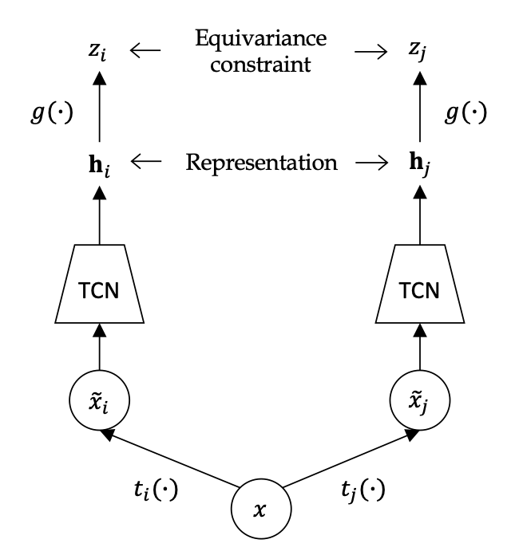

# Equivariant Self-Supervision for Musical Tempo Estimation

[Elio Quinton](https://scholar.google.com/citations?user=IaciybgAAAAJ) (Universal Music Group)

Official implementation of *Equivariant Self-Supervision for Musical Tempo Estimation*

Code will be available soon. 

## Citation

If you use this code and/or paper in your research please cite: 

[1] Elio Quinton, "Equivariant Self-Supervision for Musical Tempo", in *International Society for Music Information Retrieval Conference (ISMIR)*, 2022.